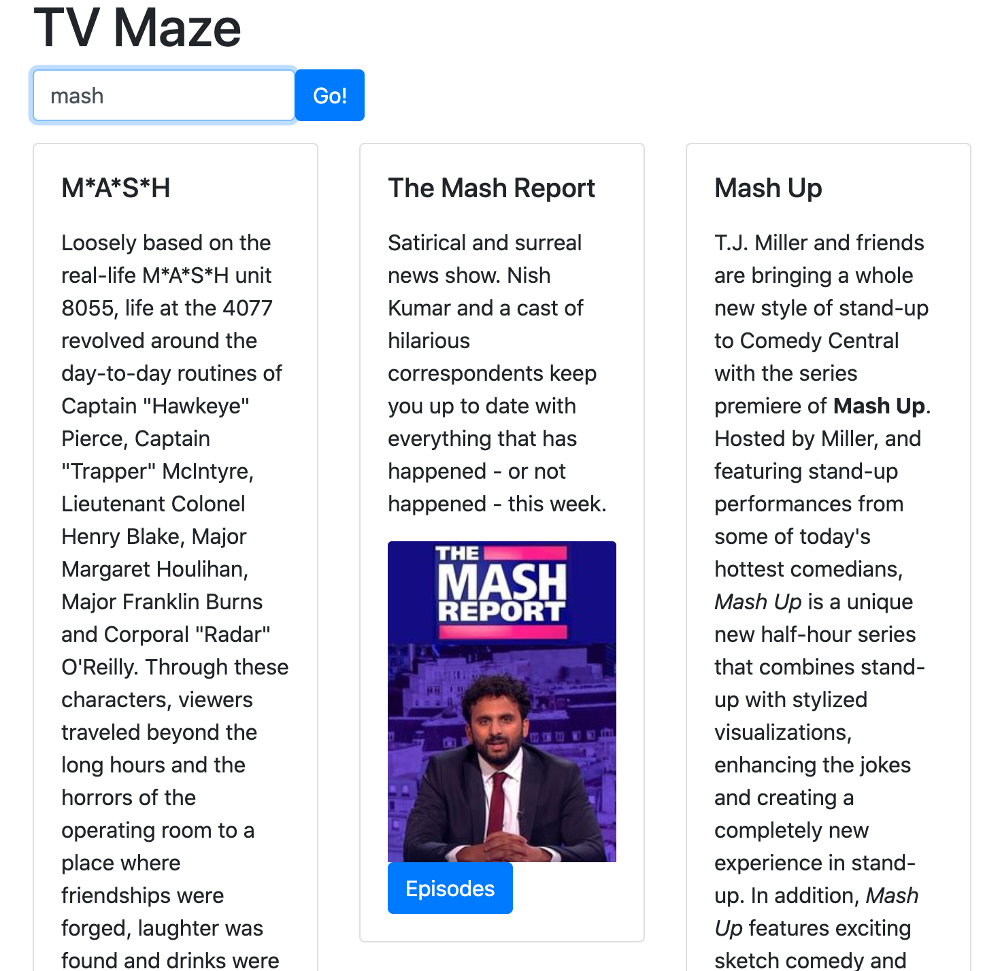
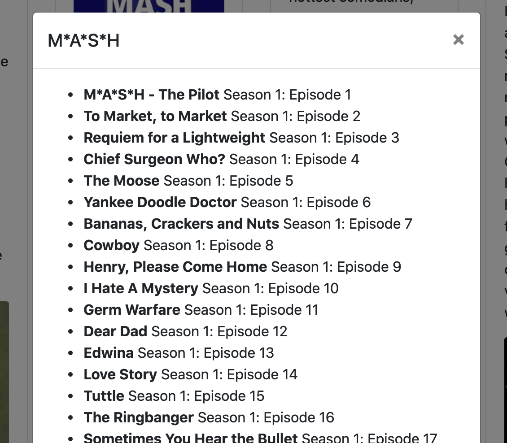

## TV Maze
TV maze is an app built for an API exercise at Springboard.  Open tvmaze.html in your browser to open the app. API calls are made with axios in javascript to the tvmaze API and results are displayed on the page.  

Click on the "episodes" button to see a list of episodes.  

The styling was done with bootstrap.  

